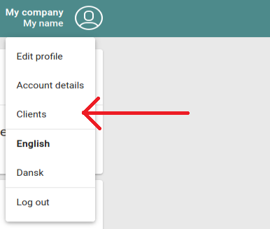

# Third-party Hello-World example project

This project is intended to illustrate third-party integration with Project Origin's services.
It showcases a few common use cases like authentication and importing data from the APIs.

This README is a walk-through guide on how to create a third-party application key, apply it to the Hello-World project,
and getting the project up and running locally.

The Hello-World example project is written in Python. It exposes a web-server using the 
[Flask](https://flask.palletsprojects.com/en/1.1.x/) web framework,
and uses [authlib](https://docs.authlib.org/en/latest/) to integrate OAuth2 authentication using
Project Origin's auth backend. [Pipenv](https://github.com/pypa/pipenv) is recommended for running
the project, but not necessary.

## Creating a third-party application

Start by creating a user and sign in on [ElOprindelse.dk](https://app.eloprindelse.dk/).

Once logged in, click on your name in the top-right corner, then click on *Clients* in the
dropdown-menu (as illustrated below):

You are redirected to a page called "My 3rd party clients." Fill out the formular as shown below:

- *Client ID*: A unique name of your client. Use lower-case letters and numbers only (no spaces, special characters etc.)
- *Name*: A human-readable name of your application
- *Secret*: An secret string only you know. Make sure to remember/save your input, as you will need this later, and can not retrieve it again
- *Callback URL*: The exact URL in your app to redirect clients to once they completed the login-flow. For the Hello-World example project fill in *http://127.0.0.1:6789/login/callback*

Once you have filled in all the fields, click the *Create Client* button. Your client should now appear in the list.

## Running Hello-World locally

This step requires Python 3.7.

Start by cloning this repository.

Open *src/helloworld/settings.py* in your text editor, and paste the Client ID and Secret you entered
in the form previously to the variables *OAUTH2_CLIENT_ID* and *OAUTH2_CLIENT_SECRET* respectively.

### Running it using Pipenv

Then run the app:

    cd hello-world/
    pipenv run python src/app.py

### Running it without Pipenv

    cd hello-world/
    pip install --user -r requirements.txt
    python3.7 src/app.py

### Navigating the UI

Once the project is running, a local webserver is available at http://127.0.0.1:6789/. From there, sign in to your
existing user (at ElOprindelse.dk), and give consent to your own application. 
